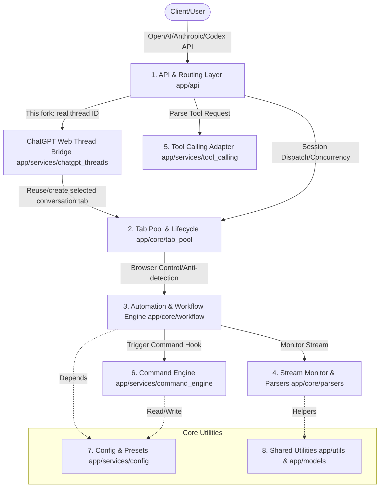

<p align="center">
  
</p>

# Universal Web API (ChatGPT Thread Bridge Fork)

📖 Documentation • [English](./README.md) • [简体中文](./README.zh-CN.md)

**Repository status**: This repository is a fork of [lumingya/universal-web-api](https://github.com/lumingya/universal-web-api). The upstream project provides the general web-to-API, tab-pool, and browser-automation foundation. **This fork adds persistent ChatGPT web-thread routing, a terminal client, and a dedicated Obsidian integration.**

The documentation below explicitly separates retained upstream capabilities from features added by this fork. Unless a capability is listed as a fork addition, it comes from or is inherited from the upstream project.

> ⚠️ **Compliance & Security Statement**: This tool runs entirely on the user's local system as a bridge helper. It **does not** provide any functionality to bypass authentication (login), crack security defenses (such as captcha solvers), or reverse-engineer encrypted APIs. Users must log into their own valid accounts in the controlled browser. Do not use this tool for high-frequency automated requests or commercial purposes.

---

## This Fork and the Upstream Project

### Retained Upstream Capabilities

This fork retains the upstream project's general-purpose functionality:

- OpenAI/Anthropic-compatible APIs backed by logged-in ChatGPT, Claude, Gemini, DeepSeek, and other web apps.
- Controlled Chromium automation, tab pooling, and domain/fixed-tab/exact-URL routing.
- Network and DOM stream parsing, multimodal extraction, attachment upload, and tool calling.
- Dashboard, site presets, request monitoring, and configurable browser workflows.

### Features Added by This Fork

The following capabilities were added by this fork and **are not part of the upstream project**:

| Fork addition | Purpose | Main file/endpoint |
| :--- | :--- | :--- |
| **ChatGPT Web Thread Bridge** | Lists sidebar conversations and continues or creates real web threads by thread ID | `app/services/chatgpt_threads.py` |
| **Thread-specific OpenAI API** | Exposes a selected `chatgpt.com/c/<thread-id>` as an OpenAI-compatible endpoint | `/api/chatgpt/threads/...` |
| **Simplified compatibility API** | Lightweight request/response format for terminal clients | `/threads`, `/thread/new`, `/thread/{id}/chat` |
| **Terminal client** | Select, create, switch, and continue web conversations without returning to the site | `chatgpt_cli.py` |
| **Obsidian integration** | Uses each real web thread as an independent OpenAI Base URL | `/api/chatgpt/threads/<id>/v1` |
| **Thread safety checks** | Fast 401 for logged-out sessions, 404 for wrong threads, and latest-user-message-only continuation | `app/api/chatgpt_thread_routes.py` |
| **macOS launch fix** | Starts a separate controlled Chrome instance and binds debugging to localhost | `start.py` |
| **Fork update protection** | Disables upstream auto-update by default so fork changes are not overwritten | `.env.example`, `start.py` |
| **Additional verification** | Tests for thread services, APIs, CLI, browser startup, and security boundaries | `tests/test_*` |

> Upstream: [lumingya/universal-web-api](https://github.com/lumingya/universal-web-api). This fork: [prestige12138/universal-web-api](https://github.com/prestige12138/universal-web-api).

---

## 📐 Project Architecture (Mermaid)



---

## 🌟 Upstream Core Capabilities Retained by This Fork

*   **⚡ Zero-config Standard Compatibility**: Fully compatible with OpenAI standard API (including `/v1/chat/completions` and `/v1/models`) with experimental compatibility support for third-party developer tools (such as `/v1/messages` connectivity testing for Claude Code and `/v1/responses` endpoint for Codex plugins).
*   **🛠️ Local Controlled Browser Drive**: Lightweight automation of Chromium-based browsers (Chrome / Edge, etc.) using DrissionPage. All data stays local for end-to-end privacy.
*   **🛡️ Human-like Interaction**: Built-in keyboard keypress simulations, focus emulation, and mouse path movements to minimize account detection.
*   **📦 Intelligent Tab Pooling**: Multi-tab concurrency with default, domain, fixed-tab, exact-URL, and URL-bound preset routes, plus first-idle, round-robin, and random allocation modes.
*   **📡 Dual-channel Stream Parsing**: Combined CDP network interception and DOM mutation monitoring to stream increments in real-time, regardless of the site's rendering technique.
*   **📎 Multimodal & Attachment Self-healing**:
    *   Extract and download text, images, audio, and video content locally from web sessions.
    *   Oversized prompts are automatically staged as local temporary files for upload (for sites that handle file-style inputs better).
*   **🧩 Robust Tool Calling**: Injects schema verification feedback loops into web sessions. If a web model produces invalid arguments, it automatically triggers local correction prompts, boosting tool-calling reliability.

---

## 🚀 Quick Start

### Prerequisites
1. OS: Windows (Fully supported) / macOS or Linux (Core features supported)
2. Requirements: **Python 3.10+** and a Chromium-based browser (Chrome, Edge, or Brave) installed.

### Setup Steps

1. **Clone this fork**: Upstream releases do not contain the additions documented above. Use:
   ```bash
   git clone https://github.com/prestige12138/universal-web-api.git
   cd universal-web-api
   ```
2. **Start the Service**:
   * **Windows**: Double-click **`start.bat`**.
   * **macOS / Linux**: Run **`python3 start.py`** in your terminal.
3. **Initialization**: Once dependencies are validated and installed, a controlled browser window will pop up automatically, and the console will open in a normal browser at `http://127.0.0.1:8199`. Keep AI websites in the controlled browser, and use your normal browser for the dashboard and tutorial.
4. **Log In**: In the controlled browser, log in to your own AI web accounts (e.g., chatgpt.com, claude.ai), then keep the target site on a real chat-ready page.
5. **Configure Clients**: In any client, set the API configurations:
   * **Base URL**: `http://127.0.0.1:8199/v1`
   * **API Key**: If auth token verification is disabled, use any value (e.g., `sk-local`). If enabled, use your custom configured token.

---

## Added by This Fork: ChatGPT Web Thread Bridge

The thread bridge lists recent conversations from the ChatGPT web sidebar and lets a terminal or OpenAI-compatible client continue a real `https://chatgpt.com/c/<thread-id>` conversation. Keep a logged-in ChatGPT tab open in the controlled browser.

Start the interactive terminal client:

```bash
python3 chatgpt_cli.py
```

For Obsidian plugins that accept a custom OpenAI endpoint, use:

```text
Base URL: http://127.0.0.1:8199/api/chatgpt/threads/<thread-id>/v1
API Key:  Any value, or AUTH_TOKEN when authentication is enabled
Model:    web-browser
```

Useful endpoints:

```text
GET  /api/chatgpt/threads
POST /api/chatgpt/threads/{thread-id}/v1/chat/completions
POST /api/chatgpt/threads/new/v1/chat/completions
GET  /threads
POST /thread/{thread-id}/chat
POST /thread/new
```

Creating a conversation only supports `stream=false`, because the web thread ID is not available until the first response completes. Existing conversations support streaming and send only the latest `user` message from an OpenAI request; the web conversation remains the source of truth for history. A `401 chatgpt_login_required` response means the controlled browser must be logged in. Keep the service bound to localhost and enable `AUTH_ENABLED` if other local applications can reach the port.

---

## 🎯 Supported Sites

Built-in automation rules are available for several mainstream AI websites. For unlisted sites, you can use the built-in AI assistant to analyze page DOM structures and generate adaptations. See [Add a New Site Guide](./static/tutorial/index.html#add-site-guide).

| Site Name | URL | Notes |
| :--- | :--- | :--- |
| **ChatGPT** | chatgpt.com | Supports extremely long prompts via file uploads |
| **DeepSeek** | chat.deepseek.com | Adapted for reasoning/thinking stream output extraction |
| **Gemini** | gemini.google.com | Excellent for testing local multimodal workflows |
| **Claude** | claude.ai | Comprehensive page interaction and attachment handling |
| **Kimi** | www.kimi.com | Excellent long-context file-paste support |
| **Qwen** | chat.qwen.ai | DOM rules adapted for domestic LLM web automation |
| **Grok** | grok.com | Decodes native websocket/HTTP stream response data |
| **Doubao** | www.doubao.com | Fully adapted for the latest page structures |
| **AI Studio** | aistudio.google.com | High-throughput developers testing environment |
| **Arena AI** | arena.ai | Comparative debugging (sensitive to IP quality) |

---

## 📖 Documentation

Detailed HTML guides are hosted locally and can be accessed via the dashboard after launch:

| Section | Description |
| :--- | :--- |
| 📖 [Full Tutorial](./static/tutorial/index.html#quick-start) | Installation, platform differences, and UI dashboard guides |
| 🔗 [Connect API](./static/tutorial/index.html#connect-api) | Request parameters, routing modes (Default, Domain, Fixed Tab, Exact URL, URL-bound Preset), and code examples |
| 🧩 [Function Calling](./static/tutorial/index.html#function-calling) | Validation repair strategy and multi-turn prompt engineering explanations |
| 🔄 [Tab Pool and Presets](./static/tutorial/index.html#tab-pool) | Configuring concurrency, route methods, allocation modes, and custom task presets |
| 📊 [Request Monitor](./static/tutorial/index.html#dashboard-advanced) | Inspect request history, failure details, per-site success rates, and debug stuck tasks |
| 🛠️ [Core Selector Configuration](./static/tutorial/index.html#selectors) | CSS selector mapping, visual workflows, and streaming options |
| 🛡️ [Stealth & Advanced Options](./static/tutorial/index.html#stealth-mode) | Anti-detection settings, browser fingerprint overrides, and low-interference modes |
| ❓ [Limitations & FAQ](./static/tutorial/index.html#faq) | Timeout troubleshooting, captcha handling, and OS differences |

---

## 🤝 Feedback & Discussion

* If you run into issues, join the QQ Group **1073037753**.
* You can also open issues or suggest features in the GitHub [Issues](../../issues) tracker.

---

## ⚖️ Disclaimer

1. **Purpose**: This project is intended solely for personal technical research, educational demonstration, and testing. Do not deploy it in production environments or use it for commercial profit-making activities.
2. **Compliance**: Before using this software, read and comply with the target sites' Terms of Service. Users are solely responsible for account limitations, suspensions, or disputes arising from using this automation tool.
3. **No Hacking**: This software does not engage in network intrusion, cracking, reverse engineering of APIs, or bypassing payment walls. All interactions are achieved by automating actions in a legitimate browser owned and logged in by the user.
4. **Liability**: The maintainers assume no liability for any direct or indirect damage or loss (including account bans, business losses, or data loss) resulting from using this software.

---

## 📄 License

This project is licensed under the [AGPL-3.0](./LICENSE).
