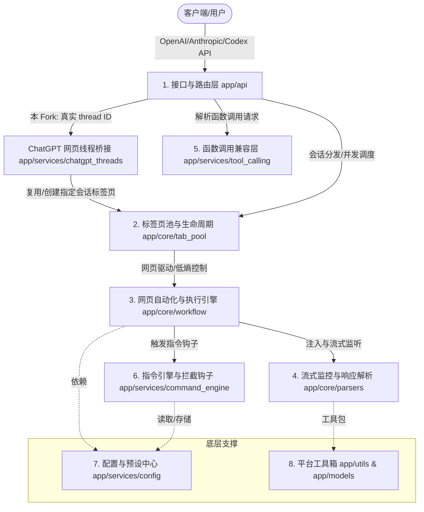

<p align="center">
  
</p>

# Universal Web API（ChatGPT Thread Bridge Fork）

📖 文档 • [English](./README.md) • [简体中文](./README.zh-CN.md)

**仓库定位**：本仓库是上游项目 [lumingya/universal-web-api](https://github.com/lumingya/universal-web-api) 的 Fork。上游项目提供通用的 AI 网页转 API、标签页池和网页自动化能力；**本 Fork 在此基础上新增了 ChatGPT 真实网页线程桥接、终端客户端和 Obsidian 专用接入方式**。

下文会明确标注“上游原项目保留能力”和“本 Fork 新增功能”。除明确列入“本 Fork 新增”的内容外，其余通用能力均来自或继承自上游项目。

> ⚠️ **合规与安全申明**：本工具仅作为一个本地自动化辅助桥接器，在用户本地系统运行。它**不具备且不提供**任何绕过目标网站身份验证（登录）、破解安全机制（如人机验证）或逆向解密接口的功能。用户需自行在受控浏览器中登录合法账号。请勿将本工具用于高频自动化请求或任何商业用途。

---

## 本 Fork 与上游项目的关系

### 上游原项目保留能力

本 Fork 完整保留上游项目的通用能力，包括：

- 将 ChatGPT、Claude、Gemini、DeepSeek 等已登录网页转换为 OpenAI/Anthropic 兼容 API。
- 受控 Chromium 浏览器、标签页池、域名/固定标签页/精确 URL 路由。
- 网络流与 DOM 双通道响应解析、多模态提取、附件上传和 Tool Calling。
- Dashboard、站点预设、请求监控和网页工作流配置。

### 本 Fork 新增功能

以下内容由本 Fork 新增，**上游原项目不包含这些功能**：

| 本 Fork 新增项 | 作用 | 主要文件/接口 |
| :--- | :--- | :--- |
| **ChatGPT 网页线程桥接** | 枚举侧边栏会话、按真实 thread ID 继续或新建网页会话 | `app/services/chatgpt_threads.py` |
| **线程专用 OpenAI API** | 把指定 `chatgpt.com/c/<thread-id>` 暴露为 OpenAI 兼容端点 | `/api/chatgpt/threads/...` |
| **简化兼容 API** | 为终端和轻量客户端提供简化请求/响应格式 | `/threads`、`/thread/new`、`/thread/{id}/chat` |
| **终端客户端** | 无需回到网页即可选择、新建、切换和继续网页会话 | `chatgpt_cli.py` |
| **Obsidian 接入方式** | 以每个真实网页线程为独立 OpenAI Base URL | `/api/chatgpt/threads/<id>/v1` |
| **线程安全边界** | 未登录快速返回 401、错误线程返回 404、续聊只发送最后一条 `user` 消息 | `app/api/chatgpt_thread_routes.py` |
| **macOS 启动修复** | 普通 Chrome 已运行时仍创建独立受控实例；调试端口仅监听本机 | `start.py` |
| **Fork 更新保护** | 默认关闭上游自动更新，避免新增功能被上游发布包覆盖 | `.env.example`、`start.py` |
| **新增验证体系** | 线程服务、API、CLI、浏览器启动与安全边界测试 | `tests/test_*` |

> 上游仓库：[lumingya/universal-web-api](https://github.com/lumingya/universal-web-api)；本 Fork：[prestige12138/universal-web-api](https://github.com/prestige12138/universal-web-api)。

---

## 📐 项目架构设计 (Mermaid 拓扑)



---

## 🌟 原项目核心能力（本 Fork 保留）

*   **⚡ 零配置、标准兼容**：提供标准 OpenAI 兼容（包括 `/v1/chat/completions` 与 `/v1/models`），并提供面向 Claude Code/Codex 等第三方编程工具的实验性兼容接入（如针对 Claude Code 的 `/v1/messages` 连通性测试，以及针对 Codex 插件的 `/v1/responses` 专用端点）。
*   **🛠️ 本地受控浏览器驱动**：基于 DrissionPage 库对本地 Chromium 内核浏览器（Chrome / Edge 等）进行轻量自动化控制，数据完全留存在本地，端到端隐私安全。
*   **🛡️ 拟人化安全调试**：内置平滑按键模拟、焦点仿真以及人鼠交互模拟，尽量降低因异常自动化检测导致的账号干扰。
*   **📦 智能标签页池调度**：内置标签页池（Tab Pool），支持默认分配、站点域名、固定标签页、精确 URL 与 URL 绑定预设路由，并提供优先空闲、轮询、随机等分配模式。
*   **📡 双通道流式解析**：结合网络层响应侦听（CDP Interception）与 DOM 增量分析双通道技术，无论网页端采用何种渲染方式，都能秒级同步输出 SSE 流式内容。
*   **📎 多模态与超长附件自愈**：
    *   自动提取并本地下载网页端的文字、图片、音频、视频内容。
    *   针对超长提示词，支持自动封装为本地临时文件进行上传（适合更偏好附件交互的网站）。
*   **🧩 智能函数调用自愈 (Tool Calling)**：在网页交互中注入参数校验反馈机制，如果模型输出的 JSON 参数校验失败，可自动发起本地回盘自愈，提高函数调用成功率。

---

## 🚀 快速开始

### 前提条件
1. 操作系统：Windows (完美支持) / macOS 或 Linux (支持基本功能)
2. 环境要求：**Python 3.10+** 且系统已安装 Chrome / Edge / Brave 等 Chromium 内核浏览器

### 安装启动步骤

1. **克隆本 Fork**：上游 Releases 不包含本 Fork 新增功能，请使用：
   ```bash
   git clone https://github.com/prestige12138/universal-web-api.git
   cd universal-web-api
   ```
2. **一键启动**：
   * **Windows**：双击运行根目录下的 **`start.bat`**。
   * **macOS / Linux**：在终端执行 **`python3 start.py`**。
3. **完成初始化**：等待依赖包自动校验安装完成后，系统会自动弹出一个受控的浏览器窗口，并在普通浏览器中打开本地控制台 `http://127.0.0.1:8199`。受控浏览器只建议放 AI 站点，控制台和教程请在普通浏览器里查看。
4. **账号登录**：在受控浏览器窗口中，登录您拥有的 AI 网站账号（如 ChatGPT、DeepSeek 等），并保持目标站点停留在可对话页面。
5. **客户端配置**：在您的任意 AI 客户端（如翻译插件、Chat UI）中修改 API 配置：
   * **API 地址 (Base URL)**：`http://127.0.0.1:8199/v1`
   * **API Key**：若未在 `.env` 中启用授权认证，可填任意值（如 `sk-local`）；若启用了配置中的密钥验证，请填写对应的自定义 Token。

---

## 本 Fork 新增：ChatGPT 网页线程桥接

线程桥接功能可以列出 ChatGPT 网页侧边栏中的近期会话，并让终端或 OpenAI 兼容客户端继续指定的真实网页会话。消息和回答会保留在 `https://chatgpt.com/c/<thread-id>` 中。

使用前请在受控浏览器中登录 `chatgpt.com`，并至少打开一个 ChatGPT 页面。网页可以留在后台。服务应只监听 `127.0.0.1`；如需认证，在 `.env` 中设置 `AUTH_ENABLED=true` 和随机的 `AUTH_TOKEN`。

### 终端直接聊天

CLI 是客户端，不会自行启动 API 服务。请使用两个终端，并保持终端 1 持续运行。

**终端 1：启动服务和受控浏览器**

```bash
cd universal-web-api
python3 start.py
```

在自动打开的受控浏览器中登录 ChatGPT。看到服务输出“服务已就绪”后，不要关闭该终端。

**终端 2：启动聊天客户端**

```bash
cd universal-web-api
python3 chatgpt_cli.py
```

CLI 会列出网页近期会话，支持选择继续或新建。启用认证时：

```bash
python3 chatgpt_cli.py --token "$AUTH_TOKEN"
```

也可以直接指定网页 URL 中的会话 UUID：

```bash
python3 chatgpt_cli.py --thread 123e4567-e89b-12d3-a456-426614174000
```

错误排查：

- `无法连接本地服务`：终端 1 没有运行 `python3 start.py`，或服务已经退出。
- `HTTP 503`：服务正在启动、受控浏览器未连接，或浏览器正在退出；等待服务就绪后重试。
- `chatgpt_login_required`：需要在受控浏览器中登录 ChatGPT。

### Obsidian / OpenAI 兼容客户端

先查询近期会话：

```bash
curl http://127.0.0.1:8199/api/chatgpt/threads
```

把支持自定义 OpenAI Base URL 的 Obsidian 插件配置为：

```text
Base URL: http://127.0.0.1:8199/api/chatgpt/threads/<thread-id>/v1
API Key:  任意值；启用 AUTH_ENABLED 时填写 AUTH_TOKEN
Model:    web-browser
```

标准流式请求示例：

```bash
curl http://127.0.0.1:8199/api/chatgpt/threads/<thread-id>/v1/chat/completions \
  -H 'Content-Type: application/json' \
  -d '{"model":"web-browser","stream":true,"messages":[{"role":"user","content":"继续总结这个会话"}]}'
```

已有线程接口只会把请求中最后一条 `user` 消息发送到网页，避免 Obsidian/OpenAI 客户端携带的完整历史在真实网页会话中重复出现；历史记录以 ChatGPT 网页线程为准。若返回 `401 chatgpt_login_required`，请先在受控浏览器中完成登录。

新建网页会话需要等待首轮完成后才能取得 thread ID，因此该接口仅接受 `stream=false`：

```bash
curl http://127.0.0.1:8199/api/chatgpt/threads/new/v1/chat/completions \
  -H 'Content-Type: application/json' \
  -d '{"model":"web-browser","stream":false,"messages":[{"role":"user","content":"创建一个新会话"}]}'
```

兼容 CatGPT-Gateway 风格的简化端点包括 `GET /threads`、`POST /thread/new` 和 `POST /thread/{thread-id}/chat`。

> 限制：侧边栏采用虚拟滚动时，`GET /threads` 通常只能返回网页当前已加载的近期会话；同一会话的请求会由标签页池串行执行。此功能仍属于本地网页自动化，可能受 ChatGPT 页面改版和账号策略影响。

---

## 🎯 已适配站点列表

系统已内置多款主流 AI 站点的自动化交互规则。对于未收录的网站，控制台还支持通过 AI 自动分析网页 DOM 结构进行适配，详情请参阅 [新增站点指南](./static/tutorial/index.html#add-site-guide)。

| 站点名称 | 官方网址 | 备注 |
| :--- | :--- | :--- |
| **ChatGPT** | chatgpt.com | 单次发送支持超长上下文 |
| **DeepSeek** | chat.deepseek.com | 已适配其深度思考 (Thinking) 流式提取 |
| **Gemini** | gemini.google.com | 适合本地多模态数据交互测试 |
| **Claude** | claude.ai | 支持完备的页面交互与附件上传 |
| **Kimi** | www.kimi.com | 支持长上下文附件粘贴模式 |
| **通义千问** | chat.qwen.ai | 国产大模型网页自动化测试 |
| **Grok** | grok.com | 支持网页原生交互流解析 |
| **豆包** | www.doubao.com | 完美适配最新版页面结构 |
| **AI Studio** | aistudio.google.com | 适合开发者高吞吐测试 |
| **Arena AI** | arena.ai | 用于盲测对比调试（对网络 IP 纯净度要求较高） |

---

## 📖 开发者文档

为了让您能够更好地自定义工作流与路由，我们准备了详细的本地 HTML 文档（可在服务启动后通过控制台访问）：

| 文档章节 | 描述说明 |
| :--- | :--- |
| 📖 [完整使用文档](./static/tutorial/index.html#quick-start) | 包含详细的安装说明、运行机制与各操作系统支持度 |
| 🔗 [连接 API 指南](./static/tutorial/index.html#connect-api) | 请求路由规则解释（默认、域名、固定标签页、精确 URL、URL 绑定预设）与调用代码示例 |
| 🧩 [智能函数调用](./static/tutorial/index.html#function-calling) | 本地 Function Calling 的多轮纠错与自愈策略说明 |
| 🔄 [标签页池与预设](./static/tutorial/index.html#tab-pool) | 如何配置多标签并发、路由方式、分配模式与预设（Presets） |
| 📊 [请求监控与排障](./static/tutorial/index.html#dashboard-advanced) | 查看请求历史、失败详情、分站点成功率，并使用调试接口取消或释放卡住的任务 |
| 🛠️ [核心选择器与配置](./static/tutorial/index.html#selectors) | CSS 选择器编写、可视化步骤定义、流式参数解释 |
| 🛡️ [低干扰与高级环境](./static/tutorial/index.html#stealth-mode) | 浏览器指纹防护、低熵行为模拟等抗检测配置 |
| ❓ [常见问题与限制说明](./static/tutorial/index.html#faq) | 超时排查、验证码处理指导、平台差异性说明 |

---

## 🤝 交流反馈

* 遇到启动或适配问题，欢迎加 QQ 交流群 **1073037753** 寻求帮助。
* 也可以在项目 [Issues](../../issues) 提交反馈或特性建议。

---

## ⚖️ 免责声明 (Disclaimer)

1. **用途限制**：本项目仅限个人用于技术研究、学术探讨、开发调试及日常办公提效。请勿将其用于生产环境或任何商业牟利活动。
2. **合规使用**：使用本软件前，请务必仔细阅读并遵守各目标 AI 网站的《服务条款》和《使用协议》。使用者因使用本软件违反服务协议而产生的账号受限、封禁或其它争议，均由使用者本人承担。
3. **技术定位**：本软件不涉及任何针对目标网站的网络入侵、破解安全屏障、API 逆向工程或绕过付费限制的行为。所有功能均基于合法的本地浏览器自动化（即模拟用户屏幕操作），且完全开源可查。
4. **免责保证**：项目维护者不对因使用本软件造成的任何直接或间接损失（包括但不限于账号损失、商业利润损失或数据丢失）承担任何责任。

---

## 📄 开源许可证

本项目基于 [AGPL-3.0](./LICENSE) 协议开源。
